# kyra

**English** | [简体中文](README_zh.md)

> A lightweight, MyBatis-style toolkit for Java that brings together XML SQL readability, a type-safe Wrapper DSL, compile-time code generation, and **zero runtime reflection**.

`kyra` is a modular framework. Beyond the SQL/ORM core it also ships a reflection-free JSON databind and a dependency-free `.xlsx` engine, plus first-class Spring Boot and Quarkus integrations. All metadata (`Reflector`, `Table`, mapper implementations) is generated at compile time, so there is no runtime classpath scanning or reflective access on the hot path.

### Highlights

- **Compile-time code generation** — `@Reflect` / `@KyraScan` generate `XxxReflector`, `XxxTable`, and `XxxMapperImpl`; no runtime reflection.
- **MyBatis-style XML mappers** — `select / insert / update / delete` with dynamic `where / if / foreach` tags and `#{...}` parameter binding.
- **Type-safe Wrapper DSL** — fluent conditions, joins, grouping, aliases, and pagination.
- **Generic CRUD** — `BaseMapper` and static `Sql` entry points cover everyday operations without writing SQL.
- **Reflection-free JSON** — `kyra-json` databinds through the generated `Reflector`, using Jackson core only for tokens.
- **Dependency-free Excel** — `kyra-excel` reads and writes `.xlsx` with a fluent API and no third-party dependencies.
- **Framework integrations** — auto-configuration for Spring Boot and Quarkus.
- **Pluggable SQL dialects** — MySQL, MariaDB, PostgreSQL, SQLite, Oracle, SQL Server, and H2 out of the box.

### Modules

| Module | Artifact | Description |
| --- | --- | --- |
| Core runtime | `kyra-core` | `@Reflect`, `Reflector`, `ReflectorRegistry`, shared runtime |
| ORM | `kyra-orm` | SQL session, `BaseMapper`, Wrapper DSL, dialect SPI |
| JSON | `kyra-json` | Reflection-free JSON databind |
| Excel | `kyra-excel` | Dependency-free `.xlsx` read/write engine |
| Reflect processor | `kyra-processor` | Generates `Reflector` and JSON installers |
| ORM processor | `kyra-orm-processor` | Generates `Table`, `MapperImpl`, and ORM installers |
| Spring Boot | `kyra-spring-boot` | Spring Boot auto-configuration |
| Quarkus | `kyra-quarkus` | Quarkus extension |
| Example | `simple` | Runnable sample module and JMH benchmarks |

## Table of Contents

- [Requirements](#requirements)
- [Quick Start](#quick-start)
  - [Dependencies](#1-dependencies)
  - [Scan Entry Point](#2-scan-entry-point)
  - [Entity and Reflector](#3-entity-and-reflector)
  - [Reflect Levels](#4-reflect-levels)
  - [JSON](#5-json)
  - [Mapper Interface](#6-mapper-interface)
  - [XML Mapper](#7-xml-mapper)
- [Runtime Usage](#runtime-usage)
- [Wrapper DSL](#wrapper-dsl)
- [`BaseMapper` Capabilities](#basemapper-capabilities)
- [`@MapperCapability`](#mappercapability)
- [SQL Dialect SPI](#sql-dialect-spi)
- [Excel](#excel)
- [Spring Boot Integration](#spring-boot-integration)
- [Quarkus Integration](#quarkus-integration)
- [Building & Testing](#building--testing)
- [Benchmarks](#benchmarks)
- [License](#license)

## Requirements

- JDK 21
- Gradle (the repository ships a Gradle Wrapper)

## Quick Start

### 1. Dependencies

```kotlin
dependencies {
    implementation("org.byteora:kyra-orm:$latest")
    annotationProcessor("org.byteora:kyra-orm-processor:$latest")
}
```

Within this multi-module repo you can also depend on project modules directly:

```kotlin
dependencies {
    implementation(project(":kyra-orm"))
    annotationProcessor(project(":kyra-orm-processor"))
}

tasks.withType<JavaCompile>().configureEach {
    options.compilerArgs.add("-Akyra.mapper=${project.projectDir}/src/main/resources/mapper")
    options.compilerArgs.add("-Akyra.module=${project.name}")
}
```

If you only need Reflectors without the ORM/SQL runtime, use the standalone Reflector module:

```kotlin
dependencies {
    implementation("org.byteora:kyra-core:$latest")
    annotationProcessor("org.byteora:kyra-processor:$latest")
}

tasks.withType<JavaCompile>().configureEach {
    options.compilerArgs.add("-Akyra.module=${project.name}")
}
```

### 2. Scan Entry Point

```java
package com.example.simple.config;

import org.byteora.kyra.orm.annotation.KyraScan;

@KyraScan(
        entity = {"com.example.simple.entity"},
        mapper = {"com.example.simple.mapper"}
)
public class KyraSimpleConfig {
}
```

### 3. Entity and Reflector

```java
package com.example.simple.entity;

import org.byteora.kyra.core.annotation.Reflect;

@Reflect
@Getter
@Setter
public class User {
    private Long id;
    private String name;
    private Integer age;
}
```

After compilation, the following are generated:

- `UserMapperImpl`
- `UserTable`
- `UserReflector`

### 4. Reflect Levels

`@Reflect` supports two metadata levels:

- `ReflectMetadataLevel.BASIC` — field access and basic metadata
- `ReflectMetadataLevel.METHOD` — additionally generates method metadata and method dispatch

Example:

```java
@Reflect(metadata = ReflectMetadataLevel.METHOD, annotationMetadata = true)
public class User {
}
```

Runtime access:

```java
Reflector<User> reflector = ReflectorRegistry.get(User.class);
User user = reflector.newInstance();
reflector.set(user, "name", "Alice");
Object value = reflector.get(user, "name");
```

### 5. JSON

`kyra-json` provides JSON databind built on `kyra-core` `Reflector`. Object creation, field reads, and writes go through `ReflectorRegistry`; Jackson core handles JSON tokens only.

```kotlin
dependencies {
    implementation("org.byteora:kyra-json:2.0.0")
    annotationProcessor("org.byteora:kyra-processor:2.0.0")
}
```

At compile time, a per-module `ServiceLoader` installer is generated; at runtime `ReflectorRegistry.get(...)` installs reflectors on demand.

```java
JsonMapper mapper = JsonMapper.builder()
        .register(new MoneyJsonHandler())
        .build();

String json = mapper.toJson(user);
User decoded = mapper.fromJson(json, User.class);
List<User> users = mapper.fromJson(jsonArray, new TypeRef<List<User>>() {});
```

Custom type handlers:

```java
final class MoneyJsonHandler implements JsonTypeHandler<Money> {
    @Override
    public boolean supports(Type type) {
        return type == Money.class;
    }

    @Override
    public void write(JsonWriterContext context, Money value) {
        context.write(value.currency() + " " + value.amount());
    }

    @Override
    public Money read(JsonReaderContext context, Type type) {
        String[] parts = context.parser().getValueAsString().split(" ", 2);
        return new Money(new BigDecimal(parts[1]), parts[0]);
    }
}
```

### 6. Mapper Interface

```java
package com.example.simple.mapper;

import com.example.simple.entity.User;
import java.util.List;

public interface UserMapper {
    User selectById(Long id);

    List<User> selectByAgeRange(Integer minAge, Integer maxAge);
}
```

### 7. XML Mapper

`namespace` must match the mapper interface FQCN:

```xml
<mapper namespace="com.example.simple.mapper.UserMapper">
    <select id="selectById">
        select id, name, age
        from users
        where id = #{id}
    </select>

    <select id="selectByAgeRange">
        select id, name, age
        from users
        <where>
            <if test="minAge != null">
                age <![CDATA[ >= ]]> #{minAge}
            </if>
            <if test="maxAge != null">
                and age <![CDATA[ <= ]]> #{maxAge}
            </if>
        </where>
        order by id
    </select>
</mapper>
```

## Runtime Usage

### Using `SqlSession` Directly

```java
JdbcDataSource dataSource = new JdbcDataSource();
dataSource.setURL("jdbc:h2:mem:test;MODE=MySQL;DB_CLOSE_DELAY=-1");
dataSource.setUser("sa");
dataSource.setPassword("");

SqlSession sqlSession = new DefaultSqlSession(dataSource);
UserMapper userMapper = new UserMapperImpl(sqlSession);

User user = userMapper.selectById(1L);
```

### SQL Debug Logging

`DefaultSqlExecutor` logs executed SQL and parameters at `DEBUG` level.

Spring Boot example:

```yaml
logging:
  level:
    org.byteora.kyra.orm.runtime.jdbc.DefaultSqlExecutor: DEBUG
```

## Wrapper DSL

Besides XML, you can build queries with the Wrapper DSL directly.

### Conditional Query

```java
List<User> users = userMapper.selectList(
        Wrapper.where()
                .where(
                        UserTable.TABLE.age.ge(18),
                        UserTable.TABLE.name.isNotNull()
                )
                .orderBy(order -> order.asc(UserTable.TABLE.id))
);
```

### Pagination

```java
Paging paging = Paging.of(1, 10);
Page<User> page = userMapper.selectPage(paging, 18, 30);
```

### Alias-aware DSL

```java
var total = Functions.count().as("total");
var ageGroup = Functions.ifElse(UserTable.TABLE.age.ge(18), "adult", "minor").as("age_group");

var query = Wrapper.query()
        .select(ageGroup, total)
        .from(UserTable.TABLE)
        .groupBy(ageGroup)
        .having(total.ge(2))
        .orderBy(order -> order.desc(total));
```

Supported:

- `orderBy(order -> order.desc(total))`
- `orderBy(order -> order.descAlias("total"))`
- `groupBy(ageGroup)`
- `groupByAlias("age_group")`
- `having(total.ge(2))`
- `having(h -> h.geAlias("total", 2))`

### Join Shortcuts

```java
var users = UserTable.TABLE;
var manager = UserTable.TABLE.alias("manager");

var query = Wrapper.query()
        .select(users.name, manager.name)
        .from(users)
        .leftJoin(manager, on -> on.eq(users.id, manager.id));
```

Column-to-column comparisons can be written directly:

```java
users.id.eq(manager.id)
users.age.ge(manager.age)
```

## `BaseMapper` Capabilities

The current example covers:

- `selectOne`
- `selectList`
- `count`
- `insert(T)`
- `insert(List<T>)`
- `updateById(T)`
- `updateById(List<T>)`
- `update(UpdateWrapper<T>)`
- `deleteById`
- `delete(WhereWrapper<T>)`
- `page(Paging, WhereWrapper<T>)`

## `@MapperCapability`

Shared SQL capabilities can be implemented as reusable components and inherited by business mappers via interface extension.

```java
public interface UpdateMapper<T> {
    int updateNameById(Long id, String name);
}

@MapperCapability(UpdateMapper.class)
public class UpdateMapperImpl<T> extends AbstractMapper<T> implements UpdateMapper<T> {
    public UpdateMapperImpl(SqlSession sqlSession, Class<?> entityClass) {
        super(sqlSession, entityClass);
    }

    @Override
    public int updateNameById(Long id, String name) {
        return sqlSession.update(
                "update users set name = ? where id = ?",
                new Object[]{name, id}
        );
    }
}
```

Supported capability constructors:

- `(SqlSession)`
- `(SqlSession, Class<?>)`
- `(SqlSession, EntityTable<?>)`

## SQL Dialect SPI

`kyra` provides a dialect SPI for:

- Identifier quoting rules
- Pagination rendering
- query/update/delete/insert renderers
- count rewrite

Core interfaces:

- `SqlDialect`
- `SqlDialectRegistry`
- `IdentifierPolicy`
- `PagingRenderer`
- `QueryRenderer`
- `UpdateRenderer`
- `DeleteRenderer`
- `InsertRenderer`
- `CountQueryRewriter`

Default dialect registry includes:

- MySQL
- MariaDB
- PostgreSQL
- SQLite
- Oracle
- SQL Server
- H2

## Spring Boot Integration

### Dependencies

```kotlin
dependencies {
    implementation("org.byteora:kyra-spring-boot:$latest")
    annotationProcessor("org.byteora:kyra-orm-processor:$latest")
}
```

### Auto-configuration

When a `DataSource` is present, `kyra-spring-boot` automatically provides:

- `SqlSessionFactory`
- Prototype-scoped `SqlSession`
- `SqlPagingSupport`
- `SqlGenerator`
- Mapper bean registrar
- Static `Sql` entry binding
- If Spring Web is on the classpath: `JsonMapper` and HTTP JSON `HttpMessageConverter` based on `kyra-json`

### Static Query Entry

```java
User user = Sql.query()
        .selectAll()
        .from(UserTable.TABLE)
        .orderBy(order -> order.asc(UserTable.TABLE.id))
        .limit(1)
        .one(User.class);
```

Shorter entry points:

```java
User user = Sql.from(UserTable.TABLE)
        .where(UserTable.TABLE.id.eq(1L))
        .one(User.class);
```

```java
User user = Sql.select(UserTable.TABLE, UserTable.TABLE.id.eq(1L));
List<User> users = Sql.selectList(
        UserTable.TABLE,
        UserTable.TABLE.age.ge(18),
        UserTable.TABLE.name.isNotNull()
);
```

Notes:

- `Sql.query()` — start from an empty query; good for complex DSL composition
- `Sql.from(table)` — defaults to `selectAll().from(table)`; quick single-table queries
- `Sql.select(table, conditions...)` — single-row semantics; internally calls `.one(table.entityType())`
- `Sql.selectList(table, conditions...)` — list semantics; internally calls `.list(table.entityType())`

Static CRUD is also available:

```java
Sql.insert(user);
Sql.updateById(user);
Sql.deleteById(User.class, 1L);
```

## Excel

`kyra-excel` is a dependency-free engine for reading and writing `.xlsx` workbooks. It has no third-party dependencies (only the JDK) and exposes a fluent, chainable API.

### Dependencies

```kotlin
dependencies {
    implementation("org.byteora:kyra-excel:$latest")
}
```

### Writing a Workbook

```java
ExcelWorkbook workbook = KyraExcel.create();
ExcelSheet sheet = workbook.sheet("Report");

sheet.width("A", 18).width("B", 12);

sheet.row(0)
        .height(24)
        .cell(
                Cell.text("Name").style(
                        Style.bold(),
                        Style.fontColor("#FFFFFF"),
                        Style.fillColor("#4472C4"),
                        Style.align(HorizontalAlign.CENTER, VerticalAlign.CENTER),
                        Style.wrapText()),
                Cell.text("Amount"));

sheet.row()
        .cell(
                Cell.text("Book"),
                Cell.currency(19.9D),
                Cell.percent(0.12D),
                Cell.date(LocalDate.of(2026, 5, 20)),
                Cell.formula("SUM(B1:B2)", 19.9D));

sheet.merge("A1:B1");
workbook.save(Path.of("report.xlsx"));
```

### Reading a Workbook

```java
ExcelWorkbook workbook = KyraExcel.open(Path.of("report.xlsx"));
ExcelSheet sheet = workbook.sheet("Report");

Object name = sheet.cell("A1").value();
String numberFormat = sheet.cell("B2").style().numberFormat();
String formula = sheet.cell("E2").formula().orElse(null);
```

You can also read from any `InputStream` via `KyraExcel.read(inputStream)`.

### Cell Factories

`Cell` provides typed factories that set both the value and an appropriate number format:

| Factory | Purpose |
| --- | --- |
| `Cell.text(String)` | Text value |
| `Cell.number(Number)` | Raw numeric value |
| `Cell.decimal(value, scale)` | Fixed-scale decimal |
| `Cell.percent(value[, scale])` | Percentage |
| `Cell.currency(value[, symbol[, scale]])` | Currency (defaults to `¥`, 2 decimals) |
| `Cell.date(...)` | Date (`LocalDate` / `OffsetDateTime` / `String`) |
| `Cell.time(...)` | Time (`LocalTime` / `OffsetDateTime` / `String`) |
| `Cell.datetime(...)` | Date-time (`LocalDateTime` / `epochMillis` / `String`) |
| `Cell.formula(formula[, cachedValue])` | Formula cell |
| `Cell.blank()` | Empty placeholder |

### Styling

Compose styles with the `Style` helpers and apply them via `Cell.style(...)` or `ExcelCell.style(...)`:

```java
CellStyle header = CellStyle.builder()
        .font(FontStyle.builder().bold(true).color("#FFFFFF").build())
        .fillColor("#4472C4")
        .horizontalAlignment("center")
        .verticalAlignment("center")
        .wrapText(true)
        .build();

sheet.cell("A1").style(header);
sheet.cell("B2").numberFormat("#,##0.00");
```

Available `Style` shortcuts include `bold()`, `italic()`, `fontColor(...)`, `fillColor(...)`, `numberFormat(...)`, `align(...)`, `center()`, `middle()`, and `wrapText()`.

### Rows, Columns, and Merges

- `sheet.row()` appends the next row; `sheet.row(index)` / `sheet.row("A3")` target a specific row.
- `row.cell(Cell...)` writes cells left-to-right; `row.skip([count])` leaves gaps.
- `sheet.width(col, w)` / `sheet.height(rowIndex, h)` size columns and rows.
- `sheet.merge("A1:B1")` / `sheet.unmerge(...)` manage merged regions.

## Quarkus Integration

### Dependencies

```kotlin
dependencies {
    implementation("org.byteora:kyra-quarkus:$latest")
    annotationProcessor("org.byteora:kyra-orm-processor:$latest")
}
```

### Auto-configuration

When a `DataSource` is present, `kyra-quarkus` automatically provides:

- `SqlExecutor`
- `SqlPagingSupport`
- `SqlGenerator`
- Mapper bean auto-registration
- Static `Sql` entry binding
- `@KyraScan` generates tables/Reflectors and installs them via registry on demand

### Usage

Same as Spring Boot: describe entity and mapper packages with `@KyraScan`:

```java
@KyraScan(
        entity = {"com.example.quarkus.entity"},
        mapper = {"com.example.quarkus.mapper"}
)
public class KyraQuarkusConfig {
}
```

Generated mappers can be injected via CDI:

```java
@Inject
UserMapper userMapper;
```

Static DSL entry points work the same way:

```java
User user = Sql.from(Tables.get(User.class))
        .limit(1)
        .one(User.class);
```

## Building & Testing

Run all tests:

```bash
./gradlew test
```

## Benchmarks

The `simple` module includes JMH benchmarks covering:

- Single-row query `selectById`
- Range query `selectByAgeRange`
- Single-row insert `insertOne`
- Single-row update `updateById`
- Single-row delete `deleteById`
- Paginated query `page`
- Batch insert `batchInsert(100 rows/batch)`

Benchmark source:

- `simple/src/test/java/com/example/simple/benchmark/SimpleMapperPerformanceBenchmark.java`

Run:

```bash
./gradlew :simple:jmh
```

Compare `Kyra` / `MyBatis-Plus` / `jOOQ` / `Jimmer` only:

```bash
./gradlew :simple:jmh --args "SimpleMapperPerformanceBenchmark.(kyra|myBatisPlus|jooq|jimmer).* -wi 1 -i 3 -w 1s -r 1s -f 1"
```

Notes:

- Default benchmark mode is `Throughput`
- Output unit is `ops/s`
- Database is in-memory `H2`
- Primary comparison: `Kyra`, `MyBatis-Plus`, `jOOQ`, `Jimmer`
- `MyBatis` query baseline code remains in the benchmark class for optional runs
- `updateById` and `deleteById` ensure target rows exist during the benchmark to avoid no-op skew

### Local Results

Test environment:

- JDK `21`
- GraalVM CE `21.0.2`
- `1` thread
- `1` warmup / `3` measurements / `1s` each

#### Four-framework comparison

| Scenario | Kyra (ops/s) | MyBatis-Plus (ops/s) | jOOQ (ops/s) | Jimmer (ops/s) |
| ------------------ | ------------ | -------------------- | ------------ | -------------- |
| `selectById` | 134,580.343 | 64,546.749 | 86,021.502 | 89,088.124 |
| `selectByAgeRange` | 14,783.318 | 1,015.885 | 9,038.434 | 14,553.187 |
| `insertOne` | 148,416.712 | 48,575.187 | 86,434.914 | 66,320.762 |
| `updateById` | 146,268.050 | 33,746.205 | 83,948.316 | 55,267.412 |
| `deleteById` | 115,751.885 | 30,104.550 | 69,977.608 | 115,694.329 |
| `page` | 5,852.455 | 4,127.696 | 5,093.807 | 5,804.739 |
| `batchInsert` | 3,981.074 | 1,411.412 | 1,921.091 | 1,754.450 |

Batch insert throughput at `100 rows/batch`:

- `Kyra`: `398,107 rows/s`
- `MyBatis-Plus`: `141,141 rows/s`
- `jOOQ`: `192,109 rows/s`
- `Jimmer`: `175,445 rows/s`

On this local run, `Kyra` leads on `selectById`, `selectByAgeRange`, `insertOne`, `updateById`, `deleteById`, `page`, and `batchInsert`.

#### Charts

```mermaid
%%{init: {"theme":"base","themeVariables":{"background":"#0f172a","primaryColor":"#2563eb","secondaryColor":"#f97316","tertiaryColor":"#22c55e","primaryTextColor":"#e5e7eb","secondaryTextColor":"#e5e7eb","tertiaryTextColor":"#e5e7eb","lineColor":"#94a3b8","textColor":"#e5e7eb","mainBkg":"#0f172a","fontFamily":"ui-sans-serif"}}}%%
xychart-beta
    title "CRUD Throughput (ops/s)"
    x-axis ["selectById", "insertOne", "updateById", "deleteById"]
    y-axis "ops/s" 0 --> 160000
    bar [134580, 148417, 146268, 115752]
    bar [64547, 48575, 33746, 30105]
    bar [86022, 86435, 83948, 69978]
    bar [89088, 66321, 55267, 115694]
```

```mermaid
%%{init: {"theme":"base","themeVariables":{"background":"#0f172a","primaryColor":"#2563eb","secondaryColor":"#f97316","tertiaryColor":"#22c55e","primaryTextColor":"#e5e7eb","secondaryTextColor":"#e5e7eb","tertiaryTextColor":"#e5e7eb","lineColor":"#94a3b8","textColor":"#e5e7eb","mainBkg":"#0f172a","fontFamily":"ui-sans-serif"}}}%%
xychart-beta
    title "Range / Page / Batch Throughput (ops/s)"
    x-axis ["selectByAgeRange", "page", "batchInsert"]
    y-axis "ops/s" 0 --> 16000
    bar [14783, 5852, 3981]
    bar [1016, 4128, 1411]
    bar [9038, 5094, 1921]
    bar [14553, 5805, 1754]
```





Legend:

- First bar group: `Kyra`
- Second bar group: `MyBatis-Plus`
- Third bar group: `jOOQ`
- Fourth bar group: `Jimmer`

## License

Licensed under the [Apache License, Version 2.0](https://www.apache.org/licenses/LICENSE-2.0).

