# kyra

[English](README.md) | **简体中文**

> 一个轻量级、偏 MyBatis 风格的 Java 工具集，融合了 XML SQL 的可读性、类型安全的 Wrapper DSL、编译期代码生成，以及**无运行时反射**。

`kyra` 是一个模块化框架。除了 SQL/ORM 核心，还提供了无反射的 JSON 序列化与零依赖的 `.xlsx` 引擎，并对 Spring Boot 与 Quarkus 提供一流集成。所有元数据（`Reflector`、`Table`、Mapper 实现）均在编译期生成，因此运行时热路径上没有任何类路径扫描或反射访问。

### 特性概览

- **编译期代码生成** —— `@Reflect` / `@KyraScan` 生成 `XxxReflector`、`XxxTable`、`XxxMapperImpl`，运行时无反射。
- **MyBatis 风格 XML Mapper** —— `select / insert / update / delete`，支持 `where / if / foreach` 动态标签与 `#{...}` 参数绑定。
- **类型安全 Wrapper DSL** —— 流式条件、join、分组、别名与分页。
- **通用 CRUD** —— `BaseMapper` 与静态 `Sql` 入口覆盖日常操作，无需手写 SQL。
- **无反射 JSON** —— `kyra-json` 通过生成的 `Reflector` 做 databind，底层只用 Jackson core 处理 token。
- **零依赖 Excel** —— `kyra-excel` 以流式 API 读写 `.xlsx`，不引入任何第三方依赖。
- **框架集成** —— Spring Boot 与 Quarkus 自动配置。
- **可插拔 SQL 方言** —— 内置 MySQL、MariaDB、PostgreSQL、SQLite、Oracle、SQL Server、H2。

### 模块一览

| 模块 | 构件 | 说明 |
| --- | --- | --- |
| 核心运行时 | `kyra-core` | `@Reflect`、`Reflector`、`ReflectorRegistry`、共享运行时 |
| ORM | `kyra-orm` | SQL 会话、`BaseMapper`、Wrapper DSL、方言 SPI |
| JSON | `kyra-json` | 无反射 JSON databind |
| Excel | `kyra-excel` | 零依赖 `.xlsx` 读写引擎 |
| Reflect 处理器 | `kyra-processor` | 生成 `Reflector` 与 JSON installer |
| ORM 处理器 | `kyra-orm-processor` | 生成 `Table`、`MapperImpl` 与 ORM installer |
| Spring Boot | `kyra-spring-boot` | Spring Boot 自动配置 |
| Quarkus | `kyra-quarkus` | Quarkus 扩展 |
| 示例 | `simple` | 可运行示例模块与 JMH 基准 |

## 目录

- [环境要求](#环境要求)
- [快速开始](#快速开始)
  - [依赖](#1-依赖)
  - [扫描入口](#2-扫描入口)
  - [实体与 Reflector](#3-实体与-reflector)
  - [Reflect 分级](#4-reflect-分级)
  - [JSON](#5-json)
  - [Mapper 接口](#6-mapper-接口)
  - [XML Mapper](#7-xml-mapper)
- [运行时使用](#运行时使用)
- [Wrapper DSL](#wrapper-dsl)
- [`BaseMapper` 通用能力](#basemapper-通用能力)
- [`@MapperCapability`](#mappercapability)
- [SQL Dialect SPI](#sql-dialect-spi)
- [Excel](#excel)
- [Spring Boot 集成](#spring-boot-集成)
- [Quarkus 集成](#quarkus-集成)
- [本地构建与测试](#本地构建与测试)
- [性能测试](#性能测试)
- [License](#license)

## 环境要求

- JDK 21
- Gradle（仓库内置 Gradle Wrapper）

## 快速开始

### 1. 依赖

```kotlin
dependencies {
    implementation("org.byteora:kyra-orm:$latest")
    annotationProcessor("org.byteora:kyra-orm-processor:$latest")
}
```

在当前多模块仓库内也可以直接依赖项目模块：

```kotlin
dependencies {
    implementation(project(":kyra-orm"))
    annotationProcessor(project(":kyra-orm-processor"))
}

tasks.withType<JavaCompile>().configureEach {
    options.compilerArgs.add("-Akyra.mapper=${project.projectDir}/src/main/resources/mapper")
    options.compilerArgs.add("-Akyra.module=${project.name}")
}
```

如果只需要 Reflector，不需要 ORM/SQL 运行时，可以单独依赖公共 Reflector 模块：

```kotlin
dependencies {
    implementation("org.byteora:kyra-core:$latest")
    annotationProcessor("org.byteora:kyra-processor:$latest")
}

tasks.withType<JavaCompile>().configureEach {
    options.compilerArgs.add("-Akyra.module=${project.name}")
}
```

### 2. 扫描入口

```java
package com.example.simple.config;

import org.byteora.kyra.orm.annotation.KyraScan;

@KyraScan(
        entity = {"com.example.simple.entity"},
        mapper = {"com.example.simple.mapper"}
)
public class KyraSimpleConfig {
}
```

### 3. 实体与 Reflector

```java
package com.example.simple.entity;

import org.byteora.kyra.core.annotation.Reflect;

@Reflect
@Getter
@Setter
public class User {
    private Long id;
    private String name;
    private Integer age;
}
```

编译后会生成：

- `UserMapperImpl`
- `UserTable`
- `UserReflector`

### 4. Reflect 分级

`@Reflect` 当前支持两档 metadata：

- `ReflectMetadataLevel.BASIC`
生成字段访问与基础元数据
- `ReflectMetadataLevel.METHOD`
额外生成方法相关元数据与方法调用分发

例如：

```java
@Reflect(metadata = ReflectMetadataLevel.METHOD, annotationMetadata = true)
public class User {
}
```

运行期访问：

```java
Reflector<User> reflector = ReflectorRegistry.get(User.class);
User user = reflector.newInstance();
reflector.set(user, "name", "Alice");
Object value = reflector.get(user, "name");
```

### 5. JSON

`kyra-json` 提供基于 `kyra-core` `Reflector` 的自有 JSON databind。对象实例创建、字段读取和写入都通过 `ReflectorRegistry` 完成，底层只使用 Jackson core 处理 JSON token。

```kotlin
dependencies {
    implementation("org.byteora:kyra-json:2.0.0")
    annotationProcessor("org.byteora:kyra-processor:2.0.0")
}
```

编译期会按模块汇总生成一个 `ServiceLoader` installer，运行时 `ReflectorRegistry.get(...)` 会按需安装。

```java
JsonMapper mapper = JsonMapper.builder()
        .register(new MoneyJsonHandler())
        .build();

String json = mapper.toJson(user);
User decoded = mapper.fromJson(json, User.class);
List<User> users = mapper.fromJson(jsonArray, new TypeRef<List<User>>() {});
```

自定义类型处理器：

```java
final class MoneyJsonHandler implements JsonTypeHandler<Money> {
    @Override
    public boolean supports(Type type) {
        return type == Money.class;
    }

    @Override
    public void write(JsonWriterContext context, Money value) {
        context.write(value.currency() + " " + value.amount());
    }

    @Override
    public Money read(JsonReaderContext context, Type type) {
        String[] parts = context.parser().getValueAsString().split(" ", 2);
        return new Money(new BigDecimal(parts[1]), parts[0]);
    }
}
```

### 6. Mapper 接口

```java
package com.example.simple.mapper;

import com.example.simple.entity.User;
import java.util.List;

public interface UserMapper {
    User selectById(Long id);

    List<User> selectByAgeRange(Integer minAge, Integer maxAge);
}
```

### 7. XML Mapper

`namespace` 必须对应 Mapper 接口全限定名：

```xml
<mapper namespace="com.example.simple.mapper.UserMapper">
    <select id="selectById">
        select id, name, age
        from users
        where id = #{id}
    </select>

    <select id="selectByAgeRange">
        select id, name, age
        from users
        <where>
            <if test="minAge != null">
                age <![CDATA[ >= ]]> #{minAge}
            </if>
            <if test="maxAge != null">
                and age <![CDATA[ <= ]]> #{maxAge}
            </if>
        </where>
        order by id
    </select>
</mapper>
```

## 运行时使用

### 直接使用 `SqlSession`

```java
JdbcDataSource dataSource = new JdbcDataSource();
dataSource.setURL("jdbc:h2:mem:test;MODE=MySQL;DB_CLOSE_DELAY=-1");
dataSource.setUser("sa");
dataSource.setPassword("");

SqlSession sqlSession = new DefaultSqlSession(dataSource);
UserMapper userMapper = new UserMapperImpl(sqlSession);

User user = userMapper.selectById(1L);
```

### SQL Debug 日志

`DefaultSqlExecutor` 会在 `DEBUG` 级别打印执行 SQL 与参数。

Spring Boot 示例：

```yaml
logging:
  level:
    org.byteora.kyra.orm.runtime.jdbc.DefaultSqlExecutor: DEBUG
```

## Wrapper DSL

除了 XML，也可以直接使用 Wrapper DSL 构造查询。

### 条件查询

```java
List<User> users = userMapper.selectList(
        Wrapper.where()
                .where(
                        UserTable.TABLE.age.ge(18),
                        UserTable.TABLE.name.isNotNull()
                )
                .orderBy(order -> order.asc(UserTable.TABLE.id))
);
```

### 分页

```java
Paging paging = Paging.of(1, 10);
Page<User> page = userMapper.selectPage(paging, 18, 30);
```

### alias-aware DSL

```java
var total = Functions.count().as("total");
var ageGroup = Functions.ifElse(UserTable.TABLE.age.ge(18), "adult", "minor").as("age_group");

var query = Wrapper.query()
        .select(ageGroup, total)
        .from(UserTable.TABLE)
        .groupBy(ageGroup)
        .having(total.ge(2))
        .orderBy(order -> order.desc(total));
```

支持：

- `orderBy(order -> order.desc(total))`
- `orderBy(order -> order.descAlias("total"))`
- `groupBy(ageGroup)`
- `groupByAlias("age_group")`
- `having(total.ge(2))`
- `having(h -> h.geAlias("total", 2))`

### join 快捷写法

```java
var users = UserTable.TABLE;
var manager = UserTable.TABLE.alias("manager");

var query = Wrapper.query()
        .select(users.name, manager.name)
        .from(users)
        .leftJoin(manager, on -> on.eq(users.id, manager.id));
```

现在列对列比较可以直接写：

```java
users.id.eq(manager.id)
users.age.ge(manager.age)
```

## `BaseMapper` 通用能力

当前示例已经覆盖：

- `selectOne`
- `selectList`
- `count`
- `insert(T)`
- `insert(List<T>)`
- `updateById(T)`
- `updateById(List<T>)`
- `update(UpdateWrapper<T>)`
- `deleteById`
- `delete(WhereWrapper<T>)`
- `page(Paging, WhereWrapper<T>)`

## `@MapperCapability`

可以把公共 SQL 能力实现成共享组件，再让业务 Mapper 通过接口继承得到这些方法。

```java
public interface UpdateMapper<T> {
    int updateNameById(Long id, String name);
}

@MapperCapability(UpdateMapper.class)
public class UpdateMapperImpl<T> extends AbstractMapper<T> implements UpdateMapper<T> {
    public UpdateMapperImpl(SqlSession sqlSession, Class<?> entityClass) {
        super(sqlSession, entityClass);
    }

    @Override
    public int updateNameById(Long id, String name) {
        return sqlSession.update(
                "update users set name = ? where id = ?",
                new Object[]{name, id}
        );
    }
}
```

支持的能力构造器：

- `(SqlSession)`
- `(SqlSession, Class<?>)`
- `(SqlSession, EntityTable<?>)`

## SQL Dialect SPI

`kyra` 现在已经提供方言 SPI，用于承载：

- 标识符引用规则
- 分页渲染
- query/update/delete/insert renderer
- count rewrite

核心接口：

- `SqlDialect`
- `SqlDialectRegistry`
- `IdentifierPolicy`
- `PagingRenderer`
- `QueryRenderer`
- `UpdateRenderer`
- `DeleteRenderer`
- `InsertRenderer`
- `CountQueryRewriter`

当前默认方言注册器：

- MySQL
- MariaDB
- PostgreSQL
- SQLite
- Oracle
- SQL Server
- H2

## Spring Boot 集成

### 依赖

```kotlin
dependencies {
    implementation("org.byteora:kyra-spring-boot:$latest")
    annotationProcessor("org.byteora:kyra-orm-processor:$latest")
}
```

### 自动配置提供

存在 `DataSource` 时，`kyra-spring-boot` 会自动提供：

- `SqlSessionFactory`
- 原型作用域 `SqlSession`
- `SqlPagingSupport`
- `SqlGenerator`
- Mapper Bean 注册器
- 静态 `Sql` 入口绑定
- 如果 Spring Web 在 classpath 中，自动注册 `JsonMapper` 与基于 `kyra-json` 的 HTTP JSON `HttpMessageConverter`

### 静态查询入口

```java
User user = Sql.query()
        .selectAll()
        .from(UserTable.TABLE)
        .orderBy(order -> order.asc(UserTable.TABLE.id))
        .limit(1)
        .one(User.class);
```

也支持更短的查询入口：

```java
User user = Sql.from(UserTable.TABLE)
        .where(UserTable.TABLE.id.eq(1L))
        .one(User.class);
```

```java
User user = Sql.select(UserTable.TABLE, UserTable.TABLE.id.eq(1L));
List<User> users = Sql.selectList(
        UserTable.TABLE,
        UserTable.TABLE.age.ge(18),
        UserTable.TABLE.name.isNotNull()
);
```

说明：

- `Sql.query()`
从空查询开始，适合复杂 DSL 组合
- `Sql.from(table)`
默认 `selectAll().from(table)`，适合从单表快速起查询
- `Sql.select(table, conditions...)`
默认单条查询语义，内部会执行 `.one(table.entityType())`
- `Sql.selectList(table, conditions...)`
默认多条查询语义，内部会执行 `.list(table.entityType())`

也支持直接静态 CRUD：

```java
Sql.insert(user);
Sql.updateById(user);
Sql.deleteById(User.class, 1L);
```

## Excel

`kyra-excel` 是一个零依赖的 `.xlsx` 读写引擎，仅依赖 JDK，提供流式可链式调用的 API。

### 依赖

```kotlin
dependencies {
    implementation("org.byteora:kyra-excel:$latest")
}
```

### 写入工作簿

```java
ExcelWorkbook workbook = KyraExcel.create();
ExcelSheet sheet = workbook.sheet("Report");

sheet.width("A", 18).width("B", 12);

sheet.row(0)
        .height(24)
        .cell(
                Cell.text("Name").style(
                        Style.bold(),
                        Style.fontColor("#FFFFFF"),
                        Style.fillColor("#4472C4"),
                        Style.align(HorizontalAlign.CENTER, VerticalAlign.CENTER),
                        Style.wrapText()),
                Cell.text("Amount"));

sheet.row()
        .cell(
                Cell.text("Book"),
                Cell.currency(19.9D),
                Cell.percent(0.12D),
                Cell.date(LocalDate.of(2026, 5, 20)),
                Cell.formula("SUM(B1:B2)", 19.9D));

sheet.merge("A1:B1");
workbook.save(Path.of("report.xlsx"));
```

### 读取工作簿

```java
ExcelWorkbook workbook = KyraExcel.open(Path.of("report.xlsx"));
ExcelSheet sheet = workbook.sheet("Report");

Object name = sheet.cell("A1").value();
String numberFormat = sheet.cell("B2").style().numberFormat();
String formula = sheet.cell("E2").formula().orElse(null);
```

也可以通过 `KyraExcel.read(inputStream)` 从任意 `InputStream` 读取。

### 单元格工厂

`Cell` 提供按类型的工厂方法，会同时设置值与合适的数字格式：

| 工厂方法 | 用途 |
| --- | --- |
| `Cell.text(String)` | 文本值 |
| `Cell.number(Number)` | 原始数值 |
| `Cell.decimal(value, scale)` | 固定小数位 |
| `Cell.percent(value[, scale])` | 百分比 |
| `Cell.currency(value[, symbol[, scale]])` | 货币（默认 `¥`、2 位小数） |
| `Cell.date(...)` | 日期（`LocalDate` / `OffsetDateTime` / `String`） |
| `Cell.time(...)` | 时间（`LocalTime` / `OffsetDateTime` / `String`） |
| `Cell.datetime(...)` | 日期时间（`LocalDateTime` / `epochMillis` / `String`） |
| `Cell.formula(formula[, cachedValue])` | 公式单元格 |
| `Cell.blank()` | 空占位单元格 |

### 样式

通过 `Style` 辅助方法组合样式，再用 `Cell.style(...)` 或 `ExcelCell.style(...)` 应用：

```java
CellStyle header = CellStyle.builder()
        .font(FontStyle.builder().bold(true).color("#FFFFFF").build())
        .fillColor("#4472C4")
        .horizontalAlignment("center")
        .verticalAlignment("center")
        .wrapText(true)
        .build();

sheet.cell("A1").style(header);
sheet.cell("B2").numberFormat("#,##0.00");
```

可用的 `Style` 快捷方法包括 `bold()`、`italic()`、`fontColor(...)`、`fillColor(...)`、`numberFormat(...)`、`align(...)`、`center()`、`middle()`、`wrapText()`。

### 行、列与合并

- `sheet.row()` 追加下一行；`sheet.row(index)` / `sheet.row("A3")` 定位指定行。
- `row.cell(Cell...)` 从左到右写入单元格；`row.skip([count])` 留出空位。
- `sheet.width(col, w)` / `sheet.height(rowIndex, h)` 设置列宽与行高。
- `sheet.merge("A1:B1")` / `sheet.unmerge(...)` 管理合并区域。

## Quarkus 集成

### 依赖

```kotlin
dependencies {
    implementation("org.byteora:kyra-quarkus:$latest")
    annotationProcessor("org.byteora:kyra-orm-processor:$latest")
}
```

### 自动配置提供

存在 `DataSource` 时，`kyra-quarkus` 会自动提供：

- `SqlExecutor`
- `SqlPagingSupport`
- `SqlGenerator`
- `JsonMapper`
- Quarkus REST 的 `application/json`、`application/*+json` 请求/响应体处理
- Mapper Bean 自动注册
- 静态 `Sql` 入口绑定
- `@KyraScan` 生成表/Reflector，并通过 registry 按需安装

REST DTO 必须有生成的 Reflector。独立 DTO 添加 `@Reflect`；位于
`@KyraScan(entity = {...})` 包中的实体已经自动覆盖。Provider 会保留端点的泛型类型，
并直接使用 `JsonMapper` 的字节 API，不产生中间 `String`。

默认 Mapper 是 Quarkus `@DefaultBean`，应用可以通过 CDI Producer 覆盖：

```java
@Produces
@Singleton
JsonMapper jsonMapper() {
    return JsonMapper.builder()
            .includeNulls(true)
            .register(new MoneyJsonHandler())
            .build();
}
```

### 用法

和 Spring Boot 一样，Quarkus 下仍然通过 `@KyraScan` 描述实体与 Mapper 包：

```java
@KyraScan(
        entity = {"com.example.quarkus.entity"},
        mapper = {"com.example.quarkus.mapper"}
)
public class KyraQuarkusConfig {
}
```

生成的 Mapper 可以直接通过 CDI 注入：

```java
@Inject
UserMapper userMapper;
```

静态 DSL 入口同样可用：

```java
User user = Sql.from(Tables.get(User.class))
        .limit(1)
        .one(User.class);
```

## 本地构建与测试

运行全部测试：

```bash
./gradlew test
```

## 性能测试

`simple` 模块内置了基于 `JMH` 的性能测试，当前覆盖这些场景：

- 单条查询 `selectById`
- 范围查询 `selectByAgeRange`
- 单条写入 `insertOne`
- 单条更新 `updateById`
- 单条删除 `deleteById`
- 分页查询 `page`
- 批量写入 `batchInsert(100 rows/batch)`

性能测试代码：

- `simple/src/test/java/com/example/simple/benchmark/SimpleMapperPerformanceBenchmark.java`

运行方式：

```bash
./gradlew :simple:jmh
```

只看 `Kyra` / `MyBatis-Plus` / `jOOQ` / `Jimmer` 对比：

```bash
./gradlew :simple:jmh --args "SimpleMapperPerformanceBenchmark.(kyra|myBatisPlus|jooq|jimmer).* -wi 1 -i 3 -w 1s -r 1s -f 1"
```

说明：

- 默认基准模式为 `Throughput`
- 输出单位为 `ops/s`
- 数据库使用内存 `H2`
- 当前主对比维度是 `Kyra`、`MyBatis-Plus`、`jOOQ`、`Jimmer`
- `MyBatis` 查询基线代码仍保留在基准类中，便于后续单独补跑
- `updateById` 与 `deleteById` 场景会在基准过程中保证命中存在数据，避免退化为大量空操作

### 本地测试数据

测试环境：

- JDK `21`
- GraalVM CE `21.0.2`
- `1` 线程
- `1` 次预热 / `3` 次测量 / 每次 `1s`

#### 四框架结果


| 场景                 | Kyra (ops/s) | MyBatis-Plus (ops/s) | jOOQ (ops/s) | Jimmer (ops/s) |
| ------------------ | ------------ | -------------------- | ------------ | -------------- |
| `selectById`       | 134,580.343  | 64,546.749           | 86,021.502   | 89,088.124     |
| `selectByAgeRange` | 14,783.318   | 1,015.885            | 9,038.434    | 14,553.187     |
| `insertOne`        | 148,416.712  | 48,575.187           | 86,434.914   | 66,320.762     |
| `updateById`       | 146,268.050  | 33,746.205           | 83,948.316   | 55,267.412     |
| `deleteById`       | 115,751.885  | 30,104.550           | 69,977.608   | 115,694.329    |
| `page`             | 5,852.455    | 4,127.696            | 5,093.807    | 5,804.739      |
| `batchInsert`      | 3,981.074    | 1,411.412            | 1,921.091    | 1,754.450      |


批量写入按 `100 rows/batch` 折算吞吐：

- `Kyra`: `398,107 rows/s`
- `MyBatis-Plus`: `141,141 rows/s`
- `jOOQ`: `192,109 rows/s`
- `Jimmer`: `175,445 rows/s`

当前这组本地结果下，`Kyra` 在 `selectById`、`selectByAgeRange`、`insertOne`、`updateById`、`deleteById`、`page`、`batchInsert` 上最高。

#### 图表

```mermaid
%%{init: {"theme":"base","themeVariables":{"background":"#0f172a","primaryColor":"#2563eb","secondaryColor":"#f97316","tertiaryColor":"#22c55e","primaryTextColor":"#e5e7eb","secondaryTextColor":"#e5e7eb","tertiaryTextColor":"#e5e7eb","lineColor":"#94a3b8","textColor":"#e5e7eb","mainBkg":"#0f172a","fontFamily":"ui-sans-serif"}}}%%
xychart-beta
    title "CRUD Throughput (ops/s)"
    x-axis ["selectById", "insertOne", "updateById", "deleteById"]
    y-axis "ops/s" 0 --> 160000
    bar [134580, 148417, 146268, 115752]
    bar [64547, 48575, 33746, 30105]
    bar [86022, 86435, 83948, 69978]
    bar [89088, 66321, 55267, 115694]
```

```mermaid
%%{init: {"theme":"base","themeVariables":{"background":"#0f172a","primaryColor":"#2563eb","secondaryColor":"#f97316","tertiaryColor":"#22c55e","primaryTextColor":"#e5e7eb","secondaryTextColor":"#e5e7eb","tertiaryTextColor":"#e5e7eb","lineColor":"#94a3b8","textColor":"#e5e7eb","mainBkg":"#0f172a","fontFamily":"ui-sans-serif"}}}%%
xychart-beta
    title "Range / Page / Batch Throughput (ops/s)"
    x-axis ["selectByAgeRange", "page", "batchInsert"]
    y-axis "ops/s" 0 --> 16000
    bar [14783, 5852, 3981]
    bar [1016, 4128, 1411]
    bar [9038, 5094, 1921]
    bar [14553, 5805, 1754]
```







图例：

- 第一组柱状为 `Kyra`
- 第二组柱状为 `MyBatis-Plus`
- 第三组柱状为 `jOOQ`
- 第四组柱状为 `Jimmer`

## License

基于 [Apache License, Version 2.0](https://www.apache.org/licenses/LICENSE-2.0) 开源。

